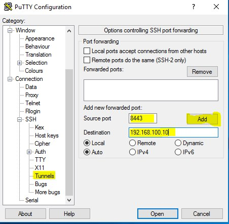

# putty

## Port forwarding

Forward a port from localhost to a configured destination on the host you will be connected to.

For example you want to connect to `192.168.100.10` with an ssh tunnel:

 - Open putty -> Connection -> SSH -> Tunnels
 - Add a new forwarded port
    - Source port - the port which will be forwarded from the localhost
    - Destination - the address the port will forward
 - After adding the tunnel config open the ssh connection to the host which should tunnel the requests
 - open `localhost:8443`, you should be connected to `192.168.100.10`